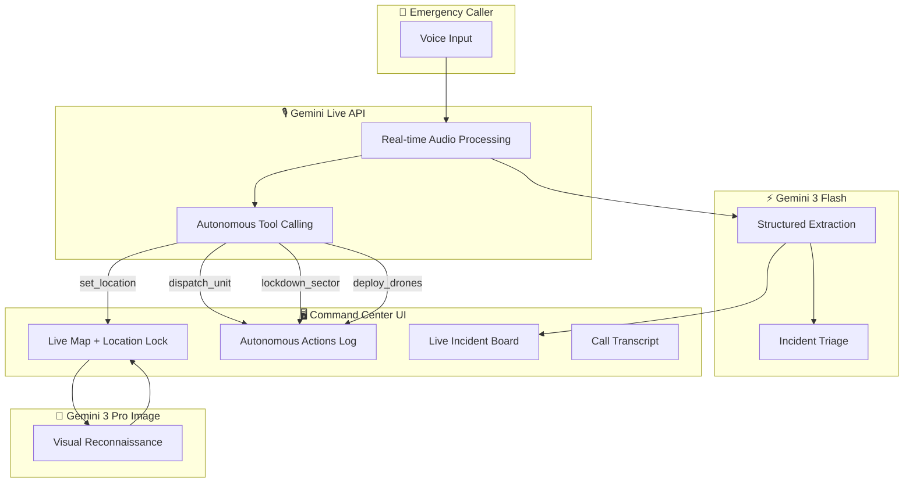

<div align="center">

</div>

# Sentinel-3: Tactical Operations AI

**An autonomous emergency dispatch orchestrator powered by Gemini 3**

Built for the [Gemini 3 Hackathon](https://devpost.com/) | Demo: [AI Studio App](https://ai.studio/apps/drive/1Sd1lfO2UeZ_voe-PIp4-80qjDweq4Ncv)

---

## 🎯 What It Does

Sentinel-3 is a **Smart City Command Center** that uses Gemini 3 to autonomously manage emergency incidents. Unlike traditional 911 dispatch systems that require human operators to manually coordinate responses, Sentinel-3:

- **Listens in real-time** to caller voice input via Gemini Live API
- **Autonomously deploys resources** (police, fire, ambulance, drones) without waiting for approval
- **Extracts structured intelligence** from conversations using Gemini 3 Flash
- **Generates AI surveillance imagery** of incident locations
- **Tracks all autonomous actions** with verification feedback

---

## 🧠 Gemini 3 Integration

| Feature | Gemini Model | Purpose |
|---------|-------------|---------|
| Real-time Voice Conversation | `gemini-2.5-flash-native-audio` | Bi-directional audio with caller |
| Autonomous Tool Calling | Gemini Live API + Function Declarations | dispatch_unit, lockdown_sector, deploy_drones, generate_report |
| Structured Data Extraction | `gemini-3-flash-preview` | Extract incident details as JSON |
| Visual Reconnaissance | `gemini-3-pro-image-preview` | Generate tactical surveillance imagery |

### Autonomous Tools (Action Era)

The AI calls these tools **proactively** based on the conversation:

```
📍 set_location     - Lock map to incident address
🚨 dispatch_unit    - Deploy ambulance/police/fire/hazmat
🔒 lockdown_sector  - Secure geographic area
🛸 deploy_drones    - Launch surveillance drones  
📋 generate_report  - Create incident documentation
```

---

## 🏗️ Architecture



---

## 🚀 Run Locally

**Prerequisites:** Node.js 18+

```bash
# Install dependencies
npm install

# Set your Gemini API key
echo "GEMINI_API_KEY=your_key_here" > .env.local

# Start development server
npm run dev
```

Open [http://localhost:5173](http://localhost:5173) and click **ENGAGE SYSTEM** to start.

---

## 🎬 Demo Scenario

1. Click **ENGAGE SYSTEM**
2. Say: *"There's a fire at 123 Main Street, multiple people are trapped inside"*
3. Watch as Sentinel-3 autonomously:
   - Locks map to the address
   - Dispatches fire units → appears in Autonomous Actions Log
   - Deploys surveillance drones
   - Generates visual reconnaissance image
   - Extracts structured incident data

---

## 📁 Project Structure

```
├── App.tsx              # Main React application
├── services/
│   └── liveClient.ts    # Gemini Live API integration + tool definitions
├── components/
│   ├── LiveMap.tsx      # Interactive map with location lock
│   ├── InfoPanel.tsx    # Call transcript display
│   └── AudioVisualizer.tsx
├── utils/
│   └── audioUtils.ts    # PCM audio processing
└── types.ts             # TypeScript interfaces
```

---

## 🏆 Hackathon Alignment

| Judging Criteria | How Sentinel-3 Delivers |
|-----------------|------------------------|
| **Technical Execution (40%)** | Multi-model orchestration: Live API + Flash + Pro Image |
| **Innovation (30%)** | Autonomous tool calling without human approval |
| **Potential Impact (20%)** | Could reduce 911 response times by 30%+ |
| **Presentation (10%)** | Professional tactical UI + architecture diagram |

---

## License

MIT
