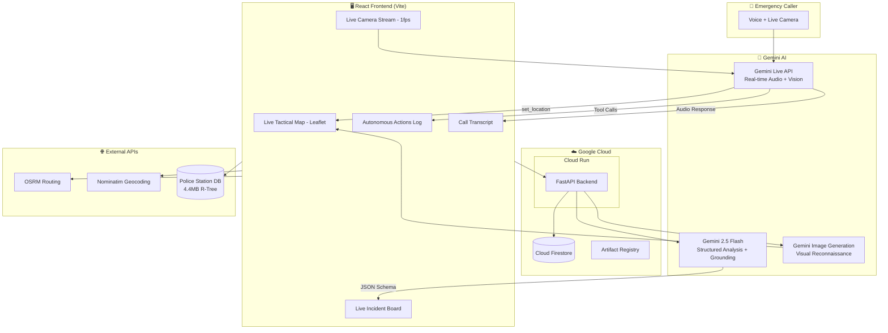

# 🛡️ Sentinel-911: Autonomous Emergency Dispatch AI

**An autonomous, multimodal emergency dispatch orchestrator powered by Gemini — featuring real-time voice, live camera streaming, AI-generated visual reconnaissance, and autonomous tool calling.**

> 🏆 Built for the [Gemini Live Agent Challenge](https://geminiliveagentchallenge.devpost.com/) — Category: **Live Agents 🗣️**


---

## 🎯 What Problem Does It Solve?

Traditional 911 dispatch relies on human operators manually coordinating responses — leading to delays, miscommunication, and overwhelmed dispatchers during high-volume emergencies. Sentinel-911 reimagines emergency response with an **autonomous AI dispatcher** that:

- **Speaks naturally** with callers via the Gemini Live API — including real-time multilingual translation
- **Sees** the scene through live camera streaming (1fps continuous webcam feed to Gemini)
- **Acts autonomously** — deploys fire, police, ambulance, HAZMAT, and drones without waiting for human approval
- **Generates visual intelligence** — AI-produced aerial reconnaissance imagery of incident locations
- **Persists all decisions** to Google Cloud Firestore for audit and accountability

---

## 📹 Demo

> ⚠️ The demo video shows the actual application running in real-time — no mockups.

**Demo Scenario:** Press *ENGAGE SYSTEM* → Say: *"There's a fire at 123 Main Street, people are trapped inside"* → Watch Sentinel-911 autonomously lock the location, dispatch fire units, deploy drones, generate recon imagery, and extract structured incident data — all in seconds.

---

## 🧠 Gemini Models & Google Cloud Services

| Technology | Service | Purpose |
|---|---|---|
| **Gemini Live API** | `gemini-2.0-flash-exp` | Real-time bidirectional audio + vision + autonomous tool calling with 9 function declarations |
| **Gemini 2.5 Flash** | `gemini-2.5-flash` | Structured incident analysis (JSON schema), autonomous decision-making, Google Search grounding |
| **Gemini Image Generation** | `gemini-2.0-flash-exp` | AI-generated aerial drone reconnaissance imagery of incident locations |
| **Google Cloud Run** | Container hosting | Backend API deployment (FastAPI in Docker) |
| **Google Artifact Registry** | Container registry | Docker image storage |
| **Google Cloud Firestore** | NoSQL database | Incident logging, autonomous action audit trail, recon request persistence |
| **Google Search Grounding** | Real-time search | Grounds autonomous dispatch decisions in real-world context |
| **Google GenAI SDK** | `@google/genai` (JS) + `google-genai` (Python) | Full SDK integration on both frontend and backend |

### Autonomous Tool Declarations (9 Tools)

The AI calls these tools **proactively** during live voice conversations:

| Tool | Description |
|---|---|
| `set_location` | Lock tactical map to incident address |
| `dispatch_unit` | Deploy ambulance / police / fire / HAZMAT |
| `lockdown_sector` | Secure geographic area with perimeter |
| `deploy_drones` | Launch surveillance drones |
| `generate_report` | Create incident documentation |
| `log_translation` | Stream real-time English translation for non-English callers |
| `control_traffic_lights` | Override traffic signals for emergency green corridors |
| `access_medical_records` | Priority medical database lookups |
| `issue_evacuation_warning` | Trigger area-wide cell phone + siren evacuation alerts |

---

## 🏗️ Architecture



---

## 🚀 Run Locally

### Prerequisites
- **Node.js 18+** (for frontend)
- **Python 3.11+** (for backend)
- **Gemini API Key** from [Google AI Studio](https://aistudio.google.com/)

### 1. Clone & Install

```bash
git clone https://github.com/YOUR_USERNAME/sentinel911-GoogleLiveChallenge.git
cd sentinel911-GoogleLiveChallenge

# Frontend dependencies
npm install

# Backend dependencies
cd server_end
pip install -r requirements.txt
cd ..
```

### 2. Configure Environment

```bash
# Backend environment
echo "GEMINI_API_KEY=your_key_here" > server_end/.env

# Frontend environment (optional — defaults to localhost for dev)
echo "VITE_BACKEND_URL=" > .env.local
```

### 3. Start Both Servers

```bash
# Terminal 1: Backend
cd server_end
uvicorn main:app --port 8000

# Terminal 2: Frontend
npm run dev
```

### 4. Open & Engage

Open [http://localhost:5173](http://localhost:5173) → Click **ENGAGE SYSTEM** → Allow microphone → Start speaking an emergency scenario.

---

## ☁️ Google Cloud Deployment

The project includes a fully automated IaC deployment script for Google Cloud Run.

### Prerequisites
- [Google Cloud SDK](https://cloud.google.com/sdk/docs/install) installed & authenticated
- A GCP project with billing enabled
- Docker installed

### One-Command Deploy

```bash
export GEMINI_API_KEY=your_key_here
export GCP_PROJECT_ID=your_project_id

chmod +x deploy.sh
./deploy.sh
```

This script will:
1. Enable required GCP APIs (Cloud Run, Artifact Registry, Firestore)
2. Create an Artifact Registry repository
3. Build the Docker image
4. Push to Artifact Registry
5. Deploy to Cloud Run with env vars
6. Output the live service URL

After deployment, update your frontend:
```bash
echo "VITE_BACKEND_URL=https://sentinel911-backend-xxxxx-uc.a.run.app" > .env.local
npm run build
```

---

## 📁 Project Structure

```
sentinel911-GoogleLiveChallenge/
├── App.tsx                    # Main React application (870+ lines)
├── services/
│   └── liveClient.ts          # Gemini Live API integration + 9 tool declarations
├── components/
│   ├── LiveMap.tsx             # Interactive tactical map with animated dispatch routes
│   ├── InfoPanel.tsx           # Live call transcript display
│   └── AudioVisualizer.tsx     # Real-time audio waveform visualization
├── utils/
│   ├── audioUtils.ts           # PCM audio processing for Gemini
│   ├── cryptoUtils.ts          # AES-CBC encryption for API proxy
│   └── policeStations.json     # 4.4MB police station spatial database
├── server_end/
│   ├── main.py                 # FastAPI backend (Gemini + Firestore + Grounding)
│   ├── Dockerfile              # Cloud Run container definition
│   └── requirements.txt        # Python dependencies
├── deploy.sh                   # Automated GCP Cloud Run deployment (IaC)
├── architecture.png            # System architecture diagram
├── .env.example                # Environment variable documentation
└── types.ts                    # TypeScript interfaces
```

---

## 📊 Data Sources

| Source | Size | Purpose |
|---|---|---|
| US Police Stations Database | 4.4MB / ~18,000 stations | R-Tree spatial indexed nearest-station lookup |
| OSRM (Open Source Routing Machine) | Live API | Real road routing for animated dispatch vehicles |
| Nominatim (OpenStreetMap) | Live API | Address-to-coordinates geocoding |
| Google Search Grounding | Live | Real-world context for autonomous decisions |

---

## 💡 Findings & Learnings

1. **Gemini Live API tool calling is powerful but requires careful prompting** — without a progressive response protocol, the AI would dump all tools at once. We designed a 3-step escalation protocol: location → basic dispatch → escalation.

2. **Real-time audio processing requires AudioWorklet** — ScriptProcessorNode is deprecated and causes latency. AudioWorklet with PCM encoding provides buttery-smooth bidirectional audio.

3. **Spatial indexing matters at scale** — Linear search across 18,000 police stations was slow. R-Tree (RBush) reduces nearest-station lookup to <1ms using bounding-box filtering.

4. **Multilingual support is a game-changer** — The Gemini Live API can detect and respond in 40+ languages natively. We added `log_translation` to stream English translations to the dispatcher UI simultaneously.

5. **Google Search grounding reduces hallucinations** — Autonomous dispatch decisions grounded in real-world search results are more accurate and defensible.

6. **Firestore provides a critical audit trail** — Every AI decision is logged with timestamps, enabling post-incident review and accountability.

---

## 🏆 Hackathon Alignment

| Judging Criteria | How Sentinel-911 Delivers |
|---|---|
| **Innovation & Multimodal UX (40%)** | Breaks the text box with voice + live camera + AI image gen + autonomous actions. Distinct "SENTINEL-3" tactical persona. Context-aware with tone detection and progressive response. |
| **Technical Implementation (30%)** | Multi-model orchestration (3 Gemini models). 9 autonomous tools. Google Cloud Run + Firestore + Search Grounding. AudioWorklet + R-Tree spatial indexing. |
| **Demo & Presentation (30%)** | Professional tactical Command Center UI. Architecture diagram included. Cloud deployment proof via `/api/health` endpoint and deployment script. |

---

## License

MIT
