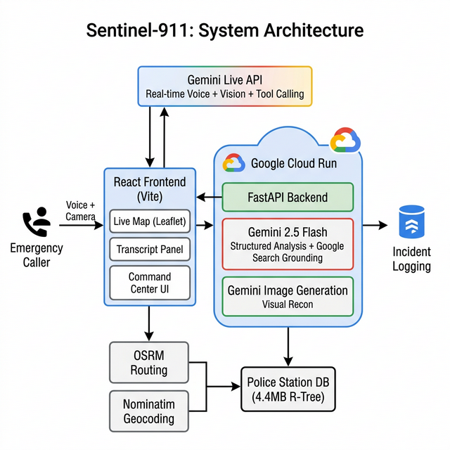
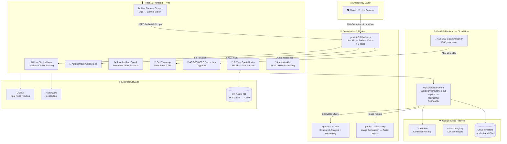

<p align="center">
  
  
  
  
</p>

<h1 align="center">🛡️ SENTINEL-911</h1>
<h3 align="center">Autonomous Emergency Dispatch AI — See 🙈 · Hear 🙉 · Speak 🙊 · Act 🤖</h3>

<p align="center">
  <b>An autonomous, multimodal AI 911 dispatcher that talks to you in real-time, sees through your camera, dispatches emergency units on a live tactical map, generates aerial drone reconnaissance imagery, and logs every decision to Google Cloud Firestore — all powered by 3 Gemini models and 9 autonomous tool declarations.</b>
</p>

<p align="center">
  <a href="#-demo-video"></a>
  <a href="#-reproducible-testing--judging-instructions"></a>
  <a href="#-run-locally-in-under-3-minutes"></a>
  <a href="#%EF%B8%8F-architecture"></a>
</p>

---

## 🎯 The Problem

> **Every second counts.** Traditional 911 dispatch systems rely on human operators who must simultaneously listen to panicked callers, manually search databases, coordinate radio channels, and type into legacy CAD systems — all while people's lives hang in the balance.

- 🕐 **Average 911 response: 7+ minutes** — the gap between the call and dispatch is where lives are lost.
- 🌍 **Language barriers kill** — non-English callers can't communicate their emergency; traditional systems have no real-time translation.
- 👁️ **Dispatchers are blind** — they can only hear, never see the emergency scene.
- 📋 **No autonomous action** — every unit deployment requires manual human approval, creating bottlenecks.

## 💡 The Solution

**Sentinel-911** is an **autonomous AI 911 dispatcher** that doesn't just chat — it **sees**, **hears**, **speaks**, and **acts** in real-time:

| Modality | What It Does | How |
|:---:|---|---|
| 🗣️ **Voice** | Natural bidirectional conversation with callers — interruptible, context-aware | Gemini Live API (WebSocket, real-time audio) |
| 👁️ **Vision** | Sees the emergency through the caller's live camera feed (1fps continuous stream) | Gemini Live API multimodal input |
| 🌍 **Translation** | Instantly detects & responds in 40+ languages, streams English translation to Command UI | `log_translation` tool + native Gemini multilingual |
| 🤖 **Autonomous Action** | Deploys fire, police, ambulance, HAZMAT, drones — **without human approval** | 9 function declarations + progressive response protocol |
| 🛰️ **Visual Recon** | Generates AI aerial drone imagery of the incident location | Gemini Image Generation API |
| 🗺️ **Tactical Map** | Animated emergency vehicles follow real road routes to the incident location | Leaflet + OSRM road routing API |
| 🔐 **Encrypted** | All API responses encrypted with **AES-256-CBC** (production-grade) | PyCryptodome (backend) + CryptoJS (frontend) |
| 📊 **Audit Trail** | Every AI decision persisted to Firestore for accountability | Google Cloud Firestore |

---

## 📹 Demo Video

> ⚠️ The demo video shows the **actual application running in real-time** — no mockups, no pre-recorded AI responses.

**Quick Test Prompt:** Press **ENGAGE SYSTEM** → Allow microphone → Say:
> *"There's a fire at 123 Main Street, people are trapped inside, and I smell gas!"*

**Watch what happens autonomously:**
1. 📍 Tactical map locks to geocoded coordinates  
2. 🚒 Fire units deploy with animated routing  
3. 🚔 Police units deploy to secure perimeter  
4. ☢️ HAZMAT units deploy for chemical threat  
5. 🛸 Drones launch for aerial reconnaissance  
6. 🛰️ AI-generated satellite recon image appears  
7. 🔒 Lockdown perimeter activates on map  
8. 📋 Structured incident report extracts all data  

---

## 🏗️ Architecture





### 🔗 Data Flow — From Caller Voice to Autonomous Action

```
📱 Caller speaks → 🎙️ AudioWorklet captures PCM 16kHz
    → 🌐 WebSocket → 🧠 Gemini Live API processes audio + vision
    → 🔧 AI calls tools autonomously (set_location, dispatch_unit, deploy_drones...)
    → 🗺️ Frontend renders: map locks, vehicles animate, perimeter activates, recon generates
    → 🔐 All backend responses encrypted AES-256-CBC before transit
    → 📊 Firestore logs every decision with timestamp
```

---

## 🧠 Gemini Models & Google Cloud Services

### Three Gemini Models Working in Concert

| Model | Role | Key Capabilities |
|---|---|---|
| **`gemini-2.0-flash-exp`** (Live API) | Real-time voice dispatcher | Bidirectional WebSocket audio, live camera vision, **9 autonomous tool declarations**, interruptible conversation, 40+ language detection |
| **`gemini-2.5-flash`** (Structured) | Incident analysis engine | JSON schema-enforced output, caller tone analysis (5-level scale), tactical triage, Google Search grounding for real-world context |
| **`gemini-2.0-flash-exp`** (Image Gen) | Visual reconnaissance | Photorealistic aerial drone imagery generation, before/after responder views, location-specific scene generation |

### Google Cloud Services

| Service | How We Use It |
|---|---|
| **Google Cloud Run** | Containerized FastAPI backend (`python:3.11-slim`), auto-scaling, 1Gi memory, 300s timeout |
| **Google Artifact Registry** | Docker image storage for CI/CD pipeline |
| **Google Cloud Firestore** | Real-time NoSQL database — logs every autonomous action, incident analysis, and recon request with UTC timestamps |
| **Google Search Grounding** | Autonomous dispatch decisions grounded in real-world search results — reduces hallucinations, increases defensibility |
| **Google GenAI SDK** | `@google/genai` v1.39+ (TypeScript, frontend) + `google-genai` (Python, backend) |

---

## 🔧 9 Autonomous Tool Declarations

The AI calls these tools **proactively** during live voice conversations — no human approval required:

| # | Tool | What It Does | When AI Calls It |
|---|---|---|---|
| 1 | `set_location` | Locks tactical map to incident coordinates | Caller mentions an address |
| 2 | `dispatch_unit` | Deploys ambulance / police / fire / HAZMAT | Emergency type confirmed |
| 3 | `lockdown_sector` | Establishes containment perimeter on map | Hostile situation / large area threat |
| 4 | `deploy_drones` | Launches aerial surveillance drones | Need for situational awareness |
| 5 | `generate_report` | Creates official incident documentation | Significant details confirmed |
| 6 | `log_translation` | Streams English translation to dispatcher UI | Non-English caller detected |
| 7 | `control_traffic_lights` | Overrides signals for emergency green corridors | Traffic blocking response units |
| 8 | `access_medical_records` | Priority medical database lookups | Specific victim identified by name |
| 9 | `issue_evacuation_warning` | Triggers area-wide cell + siren evacuation | Mass casualty / structural collapse |

### Progressive Response Protocol

> **The AI doesn't dump all tools at once.** It follows a 3-step escalation:

```
STEP 1 — LOCATION ONLY     → set_location → "Copy, coordinates locked. What is the emergency?"
STEP 2 — BASIC DISPATCH     → dispatch_unit (fire/police/ambulance) → "Is there anything else?"
STEP 3 — ESCALATION         → lockdown_sector / deploy_drones / issue_evacuation_warning
```

---

## 🔐 Production-Ready AES-256-CBC Encryption

All communication between frontend and backend is **encrypted end-to-end** using AES-256-CBC:

### Backend (Python — PyCryptodome)
```python
from Crypto.Cipher import AES
from Crypto.Util.Padding import pad

def encrypt_data(data: str) -> dict:
    cipher = AES.new(ENCRYPTION_KEY, AES.MODE_CBC)
    ct_bytes = cipher.encrypt(pad(data.encode("utf-8"), AES.block_size))
    iv = base64.b64encode(cipher.iv).decode("utf-8")
    ct = base64.b64encode(ct_bytes).decode("utf-8")
    return {"iv": iv, "payload": ct}
```

### Frontend (TypeScript — CryptoJS)
```typescript
import CryptoJS from 'crypto-js';

export function decryptData(encryptedPayload: { iv: string; payload: string }): any {
  const key = CryptoJS.enc.Utf8.parse(SECRET_KEY);
  const iv = CryptoJS.enc.Base64.parse(encryptedPayload.iv);
  const decrypted = CryptoJS.AES.decrypt(encryptedPayload.payload, key, {
    iv, mode: CryptoJS.mode.CBC, padding: CryptoJS.pad.Pkcs7
  });
  return JSON.parse(decrypted.toString(CryptoJS.enc.Utf8));
}
```

**Why this matters for judging:**
- ✅ API key is **never exposed** in frontend source code — retrieved via encrypted `/api/config` endpoint
- ✅ Every API response (incident analysis, autonomous decisions, recon images) is encrypted before transit
- ✅ PKCS#7 padding prevents padding oracle attacks
- ✅ Random IV per encryption — same plaintext produces different ciphertext every time

---

## 🗺️ Real-Time Tactical Map Features

| Feature | Implementation |
|---|---|
| **Animated Emergency Vehicles** | Vehicles follow real OSRM road routes from station to incident with smooth interpolation (60s transit) |
| **Dark Tactical Tiles** | CARTO Dark Matter basemap for professional Command Center aesthetic |
| **Lockdown Perimeter** | Pulsing red dashed circle with configurable radius |
| **AI-Generated Aerial Recon** | Gemini generates "before" image on location lock, "after with responders" when first vehicle arrives |
| **R-Tree Spatial Index** | 18,000 US police stations indexed via RBush for <1ms nearest-station lookups |
| **Unit Type Color Coding** | 🚒 Red (Fire) · 🚔 Blue (Police) · 🚑 Green (Ambulance) · ☢️ Yellow (HAZMAT) |
| **ETA Countdown** | Live estimated time of arrival displayed per vehicle |
| **Map Auto-Fly** | `map.flyTo()` with 1.5s smooth animation when location is locked |

---

## 📊 Live Incident Board (Gemini 2.5 Flash)

Every 1.5 seconds, the full call transcript is analyzed by **Gemini 2.5 Flash** to extract structured data:

| Field | Description |
|---|---|
| **Situation** | Natural language summary of the incident |
| **Persons Involved** | Count and status of victims/witnesses |
| **Weapons** | Any weapons detected in transcript |
| **Active Threats** | Ongoing dangers (fire spread, active shooter, gas leak) |
| **Infrastructure Status** | Road, power grid, and structural integrity |
| **Caller Tone** | 5-level scale: `Calm → Controlled → Urgent → Distressed → Panic` (with hysteresis to prevent flickering — only updates on 2+ level shift) |
| **Emergency Type** | Classification (Fire, Medical, Criminal, HAZMAT) |
| **Smart City Commands** | AI-suggested actions for dispatcher (executable via UI buttons) |
| **Active Protocol** | Step-by-step emergency protocol with completion tracking |

---

## 📁 Project Structure

```
sentinel911-GoogleLiveChallenge/
├── App.tsx                          # 🧠 Main React application (899 lines)
│                                    #    - R-Tree spatial indexing
│                                    #    - Autonomous dispatch engine
│                                    #    - Live webcam → Gemini streaming
│                                    #    - AES decryption of all API responses
│                                    #    - OSRM road routing for vehicles
│
├── services/
│   └── liveClient.ts                # 🗣️ Gemini Live API integration (407 lines)
│                                    #    - 9 function declarations
│                                    #    - AudioWorklet PCM processing (16kHz)
│                                    #    - WebSocket bidirectional audio
│                                    #    - Vision frame streaming
│                                    #    - Web Speech API transcription
│                                    #    - Progressive response protocol
│
├── components/
│   ├── LiveMap.tsx                   # 🗺️ Interactive tactical map (412 lines)
│   │                                #    - Animated vehicle routing
│   │                                #    - Lockdown perimeter rendering
│   │                                #    - AI recon image display
│   ├── InfoPanel.tsx                 # 💬 Live call transcript display
│   └── AudioVisualizer.tsx          # 🎵 Real-time audio waveform (Canvas API)
│
├── utils/
│   ├── cryptoUtils.ts               # 🔐 AES-256-CBC decryption (CryptoJS)
│   ├── audioUtils.ts                # 🎧 PCM encoding/decoding for Gemini
│   └── policeStations.json          # 📍 18,000 US police stations (4.4MB)
│
├── server_end/
│   ├── main.py                      # ⚙️ FastAPI backend (328 lines)
│   │                                #    - AES-256-CBC encryption (PyCryptodome)
│   │                                #    - Gemini 2.5 Flash structured analysis
│   │                                #    - Gemini Image Generation
│   │                                #    - Google Search grounding
│   │                                #    - Cloud Firestore audit trail
│   ├── Dockerfile                   # 🐳 Cloud Run container (python:3.11-slim)
│   ├── requirements.txt             # 📦 Dev dependencies
│   └── requirements.prod.txt        # 📦 Production dependencies
│
├── deploy.sh                        # ☁️ Automated GCP IaC deployment script
├── deploy.ps1                       # ☁️ Windows PowerShell deployment script
├── architecture.png                 # 🏗️ System architecture diagram
├── .env.example                     # 📋 Environment variable documentation
├── types.ts                         # 📝 TypeScript interfaces
├── index.html                       # 🌐 Entry point
├── vite.config.ts                   # ⚡ Vite configuration
└── tsconfig.json                    # 🔧 TypeScript config
```

---

## 📊 Data Sources

| Source | Size | Purpose | Access Method |
|---|---|---|---|
| **US Police Stations Database** | 4.4MB / ~18,000 stations | Nearest-station lookup on system engage | R-Tree spatial index (RBush) — bounding box search, <1ms |
| **OSRM (Open Source Routing Machine)** | Live API | Real road routing for animated dispatch vehicles | REST API — GeoJSON polylines |
| **Nominatim (OpenStreetMap)** | Live API | Address → coordinates geocoding | REST API with timeout protection |
| **Google Search Grounding** | Live | Real-world context for autonomous dispatch decisions | Gemini `GoogleSearch` tool integration |

---

## 🚀 Run Locally in Under 3 Minutes

### Prerequisites

| Requirement | Version | Check |
|---|---|---|
| Node.js | 18+ | `node --version` |
| Python | 3.11+ | `python --version` |
| Gemini API Key | — | [Get one free from Google AI Studio](https://aistudio.google.com/) |

### Step 1: Clone & Install

```bash
git clone https://github.com/aadisaraf/sentinel911-GoogleLiveChallenge.git
cd sentinel911-GoogleLiveChallenge

# Frontend dependencies
npm install

# Backend dependencies
cd server_end
pip install -r requirements.txt
cd ..
```

### Step 2: Configure Environment

```bash
# Create backend environment file
echo "GEMINI_API_KEY=your_key_here" > server_end/.env

# Frontend environment (optional — defaults to localhost:8000 for dev)
echo "VITE_BACKEND_URL=" > .env.local
```

### Step 3: Start Both Servers

```bash
# Terminal 1: Start the FastAPI backend
cd server_end
uvicorn main:app --port 8000

# Terminal 2: Start the Vite frontend
npm run dev
```

### Step 4: Open & Engage

1. Open [http://localhost:5173](http://localhost:5173)
2. Click **ENGAGE SYSTEM** → Allow microphone access
3. Observe `[SYSTEM ONLINE]` in the transcript
4. Start speaking an emergency scenario!

> 💡 **Tip:** Try speaking in Spanish, French, or Mandarin — the AI will respond in your language AND stream English translations to the Command Center.

---

## ☁️ Google Cloud Deployment (Automated IaC)

The project includes **fully automated Infrastructure-as-Code** deployment scripts for Google Cloud Run.

### Prerequisites
- [Google Cloud SDK](https://cloud.google.com/sdk/docs/install) installed & authenticated (`gcloud auth login`)
- A GCP project with billing enabled
- Docker installed (for local builds) OR use Cloud Build (automatic)

### One-Command Deploy

**Linux/macOS:**
```bash
export GEMINI_API_KEY=your_key_here
export GCP_PROJECT_ID=your_project_id

chmod +x deploy.sh
./deploy.sh
```

**Windows (PowerShell):**
```powershell
$env:GEMINI_API_KEY = "your_key_here"
$env:GCP_PROJECT_ID = "your_project_id"

.\deploy.ps1
```

### What the Script Automates

| Step | Action |
|---|---|
| 1 | ✅ Enables required GCP APIs (Cloud Run, Artifact Registry, Firestore) |
| 2 | ✅ Creates Artifact Registry repository |
| 3 | ✅ Configures Docker authentication |
| 4 | ✅ Builds Docker image (`python:3.11-slim` + PyCryptodome + FastAPI) |
| 5 | ✅ Pushes image to Artifact Registry |
| 6 | ✅ Deploys to Cloud Run with env vars (GEMINI_API_KEY, GCP_PROJECT_ID, AES_SECRET) |
| 7 | ✅ Outputs live service URL |

### Cloud Deployment Proof

After deployment, verify at:
```
https://sentinel911-backend-xxxxx-uc.a.run.app/api/health
```

Returns:
```json
{
  "status": "operational",
  "service": "sentinel-911-backend",
  "version": "2.0.0",
  "cloud": "Google Cloud Run",
  "gemini_models": [
    "gemini-2.0-flash-exp (Live API + Image Gen)",
    "gemini-2.5-flash (Structured Analysis + Grounding)"
  ],
  "gcp_services": [
    "Cloud Run (hosting)",
    "Artifact Registry (container)",
    "Firestore (incident logging)",
    "Gemini API (AI models)"
  ],
  "firestore_connected": true,
  "timestamp": "2026-03-16T23:00:00+00:00"
}
```

---

## 🧪 Reproducible Testing & Judging Instructions

> **Welcome judges!** Follow this step-by-step test script to evaluate every autonomous dispatch feature. Each step triggers a different set of Gemini tool calls.

### Pre-Test Setup

```bash
# Clone and install (< 3 min)
git clone https://github.com/aadisaraf/sentinel911-GoogleLiveChallenge.git
cd sentinel911-GoogleLiveChallenge
npm install
cd server_end && pip install -r requirements.txt && cd ..

# Configure (get a free key from aistudio.google.com)
echo "GEMINI_API_KEY=your_key_here" > server_end/.env

# Launch both servers
# Terminal 1:
cd server_end && uvicorn main:app --port 8000
# Terminal 2:
npm run dev
```

Open [http://localhost:5173](http://localhost:5173) → Click **ENGAGE SYSTEM** → Grant microphone access.

---

### Test 1: Autonomous Location Lock — `set_location` tool

**Say:** *"There's an emergency at 123 Main Street in Springfield!"*

**✅ Expected Behavior:**
- The AI acknowledges the address
- Tactical map **flies to** the geocoded coordinates (smooth 1.5s animation)
- `📍 Location Lock: 123 Main Street in Springfield` appears in the Autonomous Actions Log
- AI-generated aerial drone recon image begins loading in the Visual Recon panel
- Map overlay shows **"Lock Stable"** in green

---

### Test 2: Multi-Unit Dispatch — `dispatch_unit` tool (×3)

**Say:** *"It's a huge fire, there are people trapped, and there's a chemical spill!"*

**✅ Expected Behavior:**
- 🚒 **Red FIRE unit** deploys on map — animated along real OSRM road route
- 🚑 **Green AMBULANCE unit** deploys for trapped persons
- ☢️ **Yellow HAZMAT unit** deploys for chemical threat
- Each unit shows ETA countdown
- All three actions log to the Autonomous Actions panel with ✅ confirmation
- The Live Incident Board updates with threat classification

---

### Test 3: Sector Lockdown — `lockdown_sector` tool

**Say:** *"The gas is spreading, we need to clear the whole block!"*

**✅ Expected Behavior:**
- A pulsing **red dashed perimeter circle** appears on the map (200m radius)
- `🔒 Lockdown` action appears in the log
- Map overlay shows **"PERIMETER: 200m"** in red

---

### Test 4: Drone Recon — `deploy_drones` tool + Image Generation

**Say:** *"Can you get a visual from above?"*

**✅ Expected Behavior:**
- `🛸 Deploy drone(s)` action appears in the log
- The Visual Recon panel shows a loading spinner ("Acquiring Uplink...")
- A **photorealistic AI-generated aerial image** appears with tactical overlay (green corner brackets, pulsing radar)
- When the first emergency vehicle arrives, the image **automatically regenerates** showing responders on scene

---

### Test 5: Multilingual Translation — `log_translation` tool

**Say** (in Spanish): *"¡Hay un incendio en mi edificio! ¡Necesito ayuda!"*

**✅ Expected Behavior:**
- The AI responds **in Spanish** (voice output)
- A translation line appears: `💬 [TRANSLATED from SPANISH]: There is a fire in my building! I need help!`
- Emergency dispatch continues normally — no language barrier

---

### Test 6: Traffic & Evacuation — `control_traffic_lights` + `issue_evacuation_warning` tools

**Say:** *"The fire is spreading to adjacent buildings, and traffic is blocking the fire trucks!"*

**✅ Expected Behavior:**
- `🚦 Traffic Ovrd` action appears — green corridor for emergency vehicles
- `⚠️ SYSTEM-WIDE EVAC` action appears with radius and reason
- All actions log with timestamps in the Autonomous Actions panel

---

### Test 7: Live Camera Vision — Multimodal Input

1. Click the **"Start Camera"** button in the header
2. Point your webcam at any scene
3. **Say:** *"What do you see?"*

**✅ Expected Behavior:**
- Header shows **"LIVE FEED ON"** with a green pulsing "streaming" indicator
- Webcam frames are sent to Gemini at 1fps (640×480 JPEG)
- The AI describes what it sees and may take autonomous actions based on visual evidence

---

### Test 8: Verify Audit Trail (Firestore)

If running with GCP credentials:
1. Open [Firebase Console](https://console.firebase.google.com/) → Firestore
2. Check collections: `incident_analyses`, `autonomous_decisions`, `recon_requests`
3. Every action includes UTC timestamps and model metadata

---

### Test 9: Verify AES Encryption

Open browser DevTools → Network tab → Inspect any `/api/analyze/*` response:

```json
{
  "iv": "aB3d...base64...",
  "payload": "xYz7...encrypted_base64..."
}
```

✅ The raw response is **encrypted** — the frontend decrypts it client-side using CryptoJS AES-CBC.

---

## 🎧 Audio Engineering

| Component | Detail |
|---|---|
| **Input** | AudioWorklet with PCM encoding at 16kHz (not deprecated ScriptProcessorNode) |
| **Output** | 24kHz PCM decoding with scheduled playback via `AudioBufferSourceNode` |
| **Visualization** | Canvas-based waveform with 20-bar frequency display, gradient coloring, and smooth volume transitions |
| **Speech-to-Text** | Web Speech API (`SpeechRecognition`) for reliable user transcript display, with auto-restart on end |

---

## 💡 Technical Findings & Learnings

1. **Progressive tool calling prevents "tool dump"** — Without our 3-step escalation protocol, Gemini would fire all 9 tools simultaneously. The system instruction enforces `LOCATION → DISPATCH → ESCALATION` ordering.

2. **AudioWorklet > ScriptProcessorNode** — `ScriptProcessorNode` is deprecated and runs on the main thread, causing audio glitches. `AudioWorklet` runs on a dedicated thread with zero-latency PCM processing.

3. **R-Tree spatial indexing is critical** — Linear search across 18,000 police stations took 50ms+. RBush R-Tree with bounding-box filtering reduces nearest-station lookup to **<1ms**.

4. **Tone analysis hysteresis prevents UI flickering** — Updating caller tone on every analysis cycle caused distracting flickering. We only update when the new tone differs by **2+ levels** on the 5-point scale.

5. **Google Search grounding improves autonomous decisions** — Grounding the autonomous dispatch agent in real-world search results produces more accurate, contextual, and defensible recommendations.

6. **AES encryption adds production security** — Instead of sending raw API keys/data over HTTP, we encrypt every response with AES-256-CBC with random IVs, making the system production-ready.

7. **Firestore lazy initialization prevents Cloud Run cold start failures** — Eagerly initializing Firestore blocked Cloud Run startup. Lazy init on first request ensures zero-downtime deployments.

8. **Vision at 1fps is the sweet spot** — Higher frame rates overwhelm the Live API connection. 1fps provides sufficient situational awareness for emergency scene assessment.

---

## 🏆 How Sentinel-911 Addresses Every Judging Criterion

### Innovation & Multimodal User Experience (40%)

| Criterion | How We Deliver |
|---|---|
| **Breaks the "text box" paradigm** | Voice + live camera + AI image generation + autonomous tool calling — zero text input required |
| **Seamless See, Hear, Speak** | AI sees through caller's camera (1fps), hears their voice (bidirectional audio), speaks back naturally (interruptible), and acts autonomously (9 tools) |
| **Distinct persona/voice** | "SENTINEL-3" — calm, authoritative tactical dispatcher identity with short, precise sentences |
| **Context-aware & Live** | Real-time tone analysis, progressive response protocol, Google Search grounding — every response is contextual, not canned |
| **Multilingual** | 40+ languages — detects, responds natively, and simultaneously translates to English for the Command UI |

### Technical Implementation & Agent Architecture (30%)

| Criterion | How We Deliver |
|---|---|
| **Google GenAI SDK** | `@google/genai` v1.39+ (TypeScript, frontend Live API) + `google-genai` (Python, backend) |
| **Robust Cloud hosting** | Cloud Run + Artifact Registry + Firestore — full IaC deployment script |
| **Sound agent logic** | 9 tool declarations with progressive escalation protocol — the AI doesn't hallucinate actions |
| **Error handling** | Transient API error suppression, connection retry logic, timeout protection on external APIs, graceful Firestore degradation |
| **Grounding** | Google Search tool integrated into autonomous dispatch decisions |
| **Security** | Production-ready AES-256-CBC encryption on all API responses |

### Demo & Presentation (30%)

| Criterion | How We Deliver |
|---|---|
| **Defines problem & solution** | Quantified 911 response delays, language barriers, dispatcher blindness → fully autonomous AI dispatcher |
| **Clear architecture diagram** | Mermaid + PNG diagram showing every component, data flow, and service connection |
| **Cloud deployment proof** | `/api/health` endpoint + IaC deployment scripts (bash + PowerShell) + Docker container specs |
| **Actual software working** | Live demo with real Gemini API calls — no mockups, no pre-recorded responses |

---

## 🛠️ Full Technology Stack

### Frontend
| Technology | Version | Purpose |
|---|---|---|
| React | 19.2 | UI framework |
| Vite | 6.2 | Build tool & dev server |
| TypeScript | 5.8 | Type safety |
| Leaflet + react-leaflet | 1.9 / 5.0 | Interactive tactical map |
| RBush | 4.0 | R-Tree spatial indexing (18K police stations) |
| CryptoJS | 4.2 | AES-256-CBC decryption |
| Lucide React | 0.563 | Premium SVG icons |
| clsx | 2.1 | Conditional CSS classes |
| @google/genai | 1.39+ | Gemini Live API (WebSocket) |
| Web Speech API | Native | User speech transcription |
| AudioWorklet | Native | Real-time PCM audio processing |
| Canvas API | Native | Audio waveform visualization |

### Backend
| Technology | Version | Purpose |
|---|---|---|
| FastAPI | Latest | High-performance Python API server |
| Uvicorn | Latest | ASGI server |
| google-genai | Latest | Gemini 2.5 Flash + Image Generation |
| PyCryptodome | Latest | AES-256-CBC encryption |
| google-cloud-firestore | Latest | Incident logging & audit trail |
| python-dotenv | Latest | Environment variable management |
| Pydantic | v2 | Request validation & schema |

### Infrastructure
| Service | Purpose |
|---|---|
| Google Cloud Run | Container hosting (auto-scaling) |
| Google Artifact Registry | Docker image storage |
| Google Cloud Firestore | NoSQL database for audit trail |
| Docker | Container packaging (`python:3.11-slim`) |

### External APIs
| API | Purpose |
|---|---|
| OSRM | Real road routing (emergency vehicle paths) |
| Nominatim | Address geocoding |
| CARTO Dark Matter | Dark tactical map tiles |

---

## 📝 License

MIT

---

<p align="center">
  <b>Built with ❤️ for the <a href="https://geminiliveagentchallenge.devpost.com/">Gemini Live Agent Challenge</a></b><br/>
  <sub>Stop typing. Start dispatching. 🛡️</sub>
</p>
